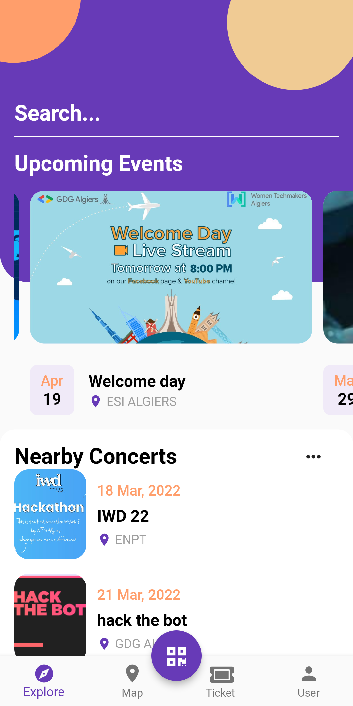
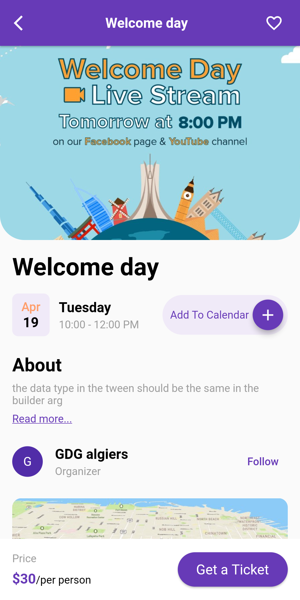

# Chalenge description

GDG Algiers is organizing the first version of the Flutter Festival, including several surprises and activities and a special challenge that is presented in this repository.

The challenge objective is to test flutter skills of the challengers in facing several problems and bugs through their work, the challenger is presented with a flutter project filled with bugs and problems that can be tricky and funny to solve.

## How ?

The main objective of the challenge is to obtain this graphical interface by making a minimum of modification in this repo.

in the end, these features must remain implemented

- Hero Animation
- Slide Animation
- Drag down image to pop screen

|      home screen      |      details screen      |
| :-------------------: | :----------------------: |
|  |  |

## Steps to participate

- [ ] Fork the repository
- [ ] Find the bugs and errors
- [ ] Fix the errors
- [ ] Once you got a clean environment You WIN

### Important

if you want your solution to stay private , create a new repo by using this template and invite [GDG ALgier's account](https://github.com/GDGAlgiers16) to your repo

good luck !
Here's your flag: pwv+xmKXlJBpRTqoovw4wkAfmSSMhrZ9hNzd7tZTReD
